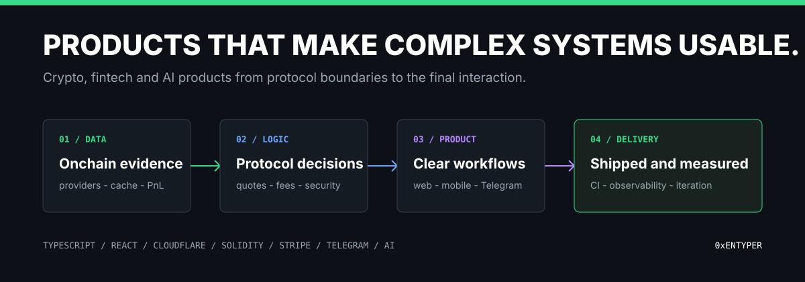
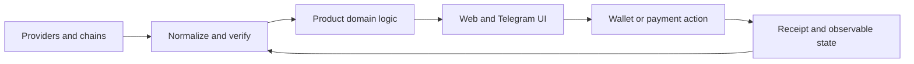

# 0xENTYPER

### Product engineer building crypto, fintech and AI systems.

From onchain data and protocol logic to payments, Telegram and the interface a user actually touches.

## What I build

I design and ship products where correctness has to survive the full path from an external data source or smart contract to a clear user decision. My work combines product strategy, UX, frontend engineering, backend boundaries, data normalization, wallet flows, billing, automation, and production delivery.

| Focus | What that means in practice |
| --- | --- |
| Product engineering | Turn a fragmented workflow into one usable system |
| Onchain data | Make provider disagreement, freshness, and uncertainty visible |
| Protocol UX | Translate fees, slippage, signing, and lifecycle into understandable actions |
| Payments and access | Connect Stripe billing to durable server-side entitlements |
| AI and automation | Add signal and leverage without hiding provenance or product control |
| Delivery | Test, deploy, observe, and iterate from real behavior |

## Shipped products

<table>
  <tr>
    <td width="50%" valign="top">
      
      <h3><a href="https://github.com/0xENTYPER/pnlflex">PNLFlex</a></h3>
      Wallet and PnL tracking connected to a visual studio for crypto creators. The product joins research, verification, chart composition, and publishing in one workflow.
        
      <a href="https://pnlflex.xyz"><strong>Live product</strong></a>
    </td>
    <td width="50%" valign="top">
      
      <h3><a href="https://github.com/0xENTYPER/baggy">Baggy</a></h3>
      Non-custodial multi-chain discovery, token launch, trading, and portfolio context. Designed to reduce the distance between finding a market and acting on it.
        
      <a href="https://baggyapp.win"><strong>Live product</strong></a>
    </td>
  </tr>
  <tr>
    <td colspan="2" valign="top">
      
      <h3><a href="https://github.com/0xENTYPER/elon-tracker">ElonTracker</a></h3>
      AI-powered analytics for post-count prediction markets: real-time activity, historical behavior, market context, signals, Telegram delivery, and Stripe-backed paid access.
        
      <a href="https://elon-tracker.com"><strong>Live product</strong></a>
    </td>
  </tr>
</table>

## Engineering case studies

These repositories isolate difficult product boundaries into small, runnable systems. They are public reference implementations rather than production source dumps.

### Architecture and runtime

<table>
  <tr>
    <td width="50%" valign="top">
      
      <h3><a href="https://github.com/0xENTYPER/web3-product-architecture">Web3 product architecture</a></h3>
      Five architecture decisions for products that must reconcile providers, chains, payments, automation, and user-facing evidence. Includes the trade-offs behind each boundary.
    </td>
    <td width="50%" valign="top">
      
      <h3><a href="https://github.com/0xENTYPER/cloudflare-web3-api-gateway">Cloudflare Web3 API gateway</a></h3>
      A runnable edge gateway with multi-provider normalization, fresh and stale KV caching, rate limiting, provenance, graceful degradation, structured logs, and tests.
    </td>
  </tr>
</table>

### Focused labs

| Repository | Engineering question | Evidence inside |
| --- | --- | --- |
| [multi-chain-token-resolver](https://github.com/0xENTYPER/multi-chain-token-resolver) | How do EVM and Solana addresses become one defensible token snapshot? | Pair scoring, MCAP/FDV semantics, provenance, tests |
| [onchain-market-data-pipeline](https://github.com/0xENTYPER/onchain-market-data-pipeline) | How should an edge API behave when market providers disagree or fail? | Worker lifecycle, KV freshness, fallback matrix |
| [wallet-pnl-lab](https://github.com/0xENTYPER/wallet-pnl-lab) | How can realized PnL avoid inventing cost basis? | FIFO lots, coverage, unknown-cost exits, UTC calendar |
| [bonding-curve-simulator](https://github.com/0xENTYPER/bonding-curve-simulator) | How can frontend quotes remain comparable with contract economics? | Bigint math, invariant tests, slippage, graduation |
| [stripe-web3-entitlements](https://github.com/0xENTYPER/stripe-web3-entitlements) | How does a Stripe event safely become wallet-linked access? | HMAC, replay protection, ordering, grace policy |
| [telegram-miniapp-starter](https://github.com/0xENTYPER/telegram-miniapp-starter) | What makes a Mini App secure and useful in both private and group chats? | Real UI, initData verification, command routing |

## One connected system

The same principles appear across the portfolio:

- uncertainty is represented instead of polished away;
- client success screens are not treated as server authority;
- wallet actions show their economic and network context before signing;
- reusable domain logic stays separate from provider and interface adapters;
- visual hierarchy follows the user's decision, not the internal data model;
- public case studies explain boundaries without exposing private credentials or production controls.

## Selected stack

## How I work

1. Start from the user decision and map the evidence required to support it.
2. Make failure, freshness, fees, and confidence part of the product contract.
3. Isolate domain logic so it can be tested without the interface or provider.
4. Build the real workflow early, then refine it from observed friction.
5. Document why a boundary exists, not only what the code does.

---

Built by [0xENTYPER](https://github.com/0xENTYPER).
